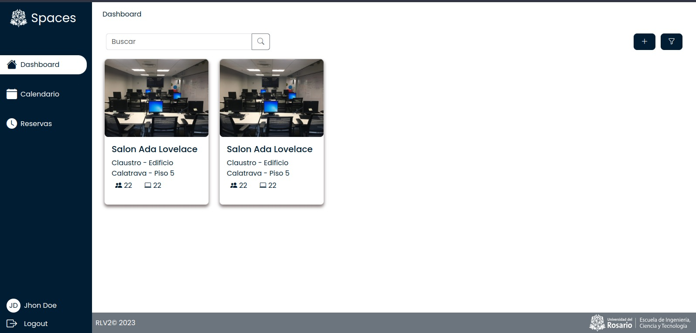
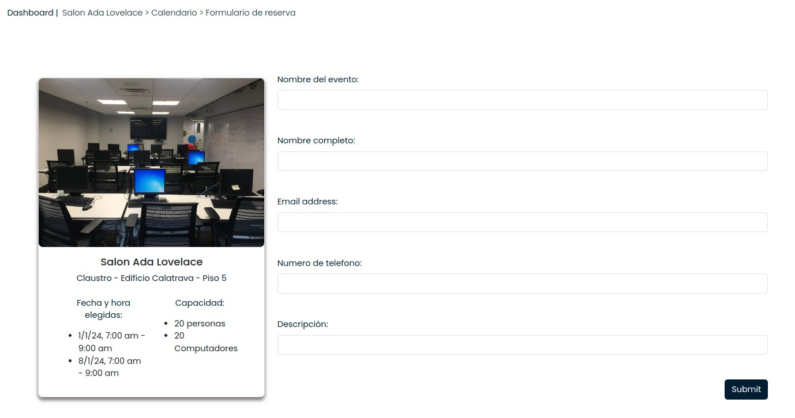

# Taller bootstrap

Como se hablo en clase las páginas realizadas a partir de los wireframes de alta calidad son validas como el taller. Las páginas que hice se encuentran en: https://github.com/Feligx/EICTSpaces-WEB/tree/Guillermo.

Para esto use los siguientes componentes de bootstrap:

* Las páginas estan enlazadas.

* Barra de navegación principal como sidebar:
    

* Carrusel poner el de clase
    Se encuentra el trabajado en clase en:
    https://github.com/BuffGRbrain/DesarrolloWeb/blob/main/PracticaHTML/views/idk2.html 

* Elementos varios:

    * Iconos de bootstrap
        Se usaron varios como la casita en el side bar, ayudandonos de la página: https://icons.getbootstrap.com/.
    * Botones:
        En el side bar todos los iconos son clickeables que se hizo con botones de bootstrap.

    * Desplegable
        

    * Sección con cards:  
        Card para la visa de espacios para administrador e usuario.
            
    * Formulario:

      
    

* Modal para cuadros de confirmación o cancelación.
  

Estos fueron adaptados según el diseño del wireframe.
